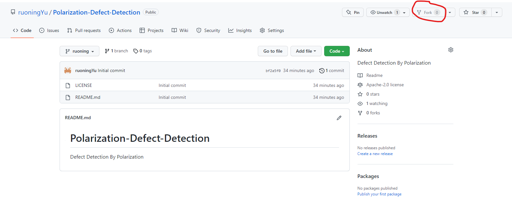
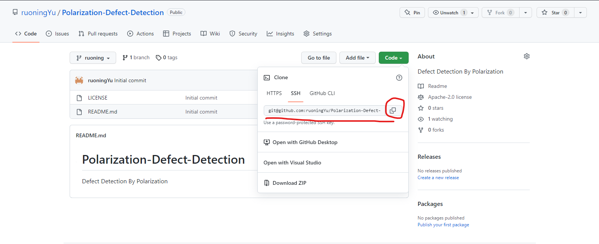
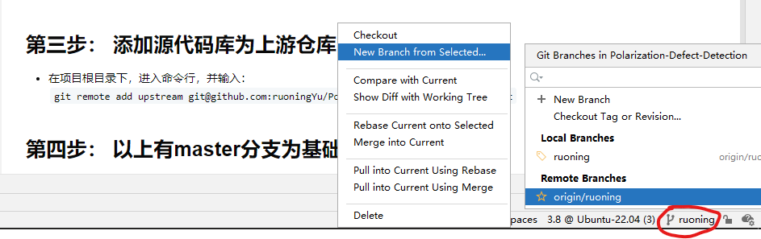
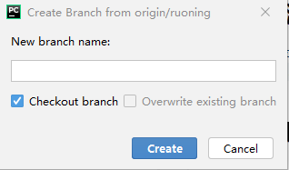
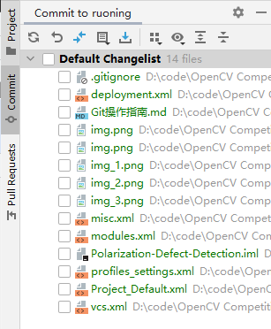
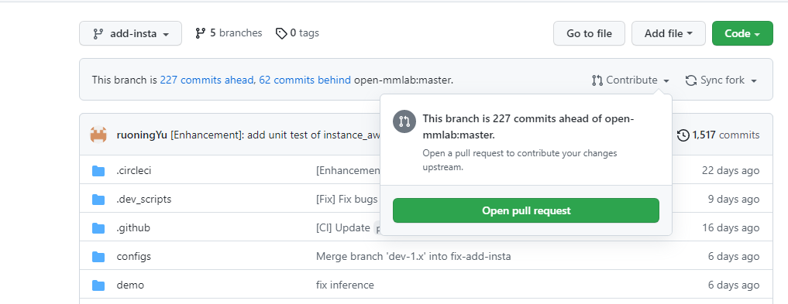
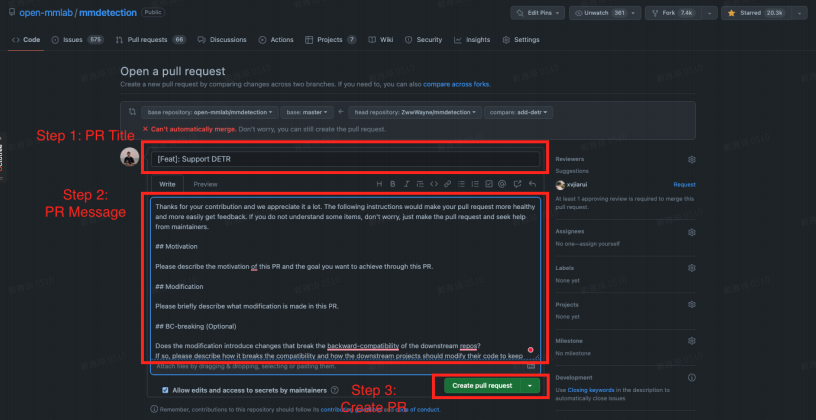

# Git 操作指南
**默认使用python + pycharm进行项目开发**
## 第一步： fork仓库

- 点击仓库右上角的fork标志，即可将目标仓库fork至自己的库下

  
## 第二步： 将仓库克隆至本地
-  在绿色的code按钮下，copy仓库地址

   
- 在本地命令行中输入
` git clone git@github.com:ruoningYu/Polarization-Defect-Detection.git`
  即可将仓库克隆至本地

## 第三步： 添加源代码库为上游仓库
- 在项目根目录下，进入命令行，并输入：

    ` git remote add upstream git@github.com:ruoningYu/Polarization-Defect-Detection.git`
  
## 第四步： 以上有master分支为基础，创建新分支




- 在pycharm右下角选中红圈内的分支名，在远程分支基础上，选择 `New Branch from Selected...`创建新分支
  
  
  **分支创建基本要求**：
  - 写清分支作用或目的
    
    修复某一问题 `fix-issue-0001` 
  
    添加某一功能 `add-img-denosing`
  - 每次提交pr功能尽量单一，并明确（一次提交太多，有问题就比较难定位难改）
  
## 第五步：提交代码
可以使用pycharm自带的git中进行提交



- 记得在下方的Commit Message中写明提交内容的概述

或者在根目录下，打开命令行，输入：
```shell
git commit -m "[Feature]: add something..."
git push -u origin [分支名]
```

## 第六步：向源代码库提交pr
- 代码提交之后，在fork的仓库内，选择Contribute中的 `Open pull request`

- 填写pr信息，然后提交

